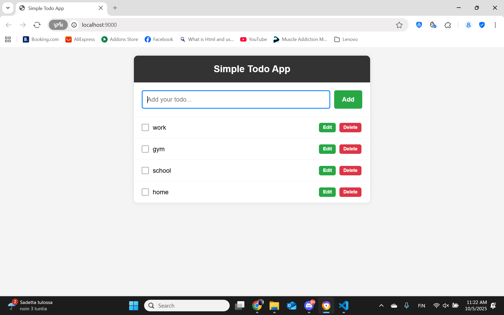
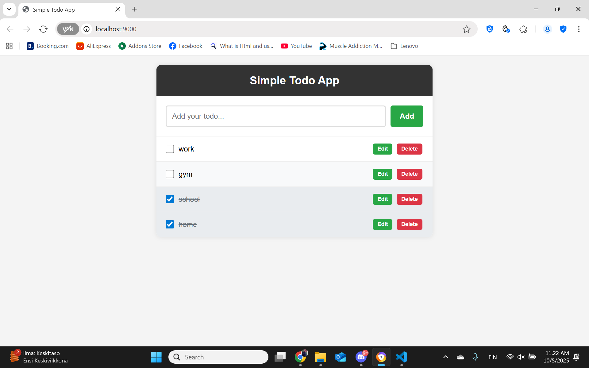
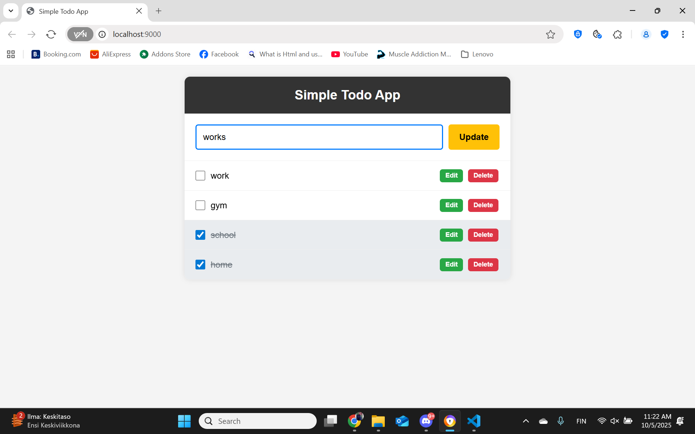
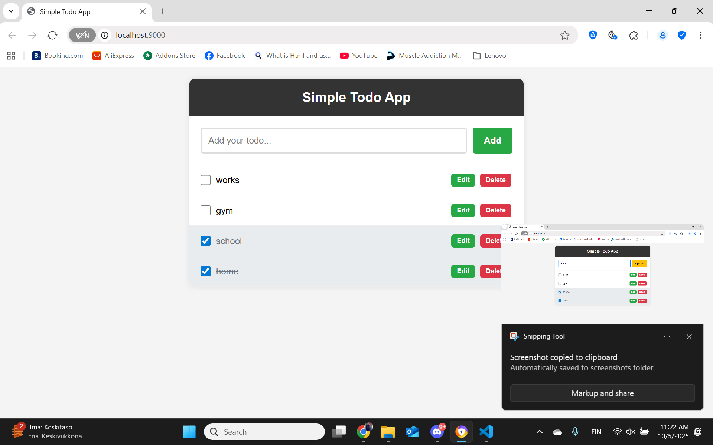
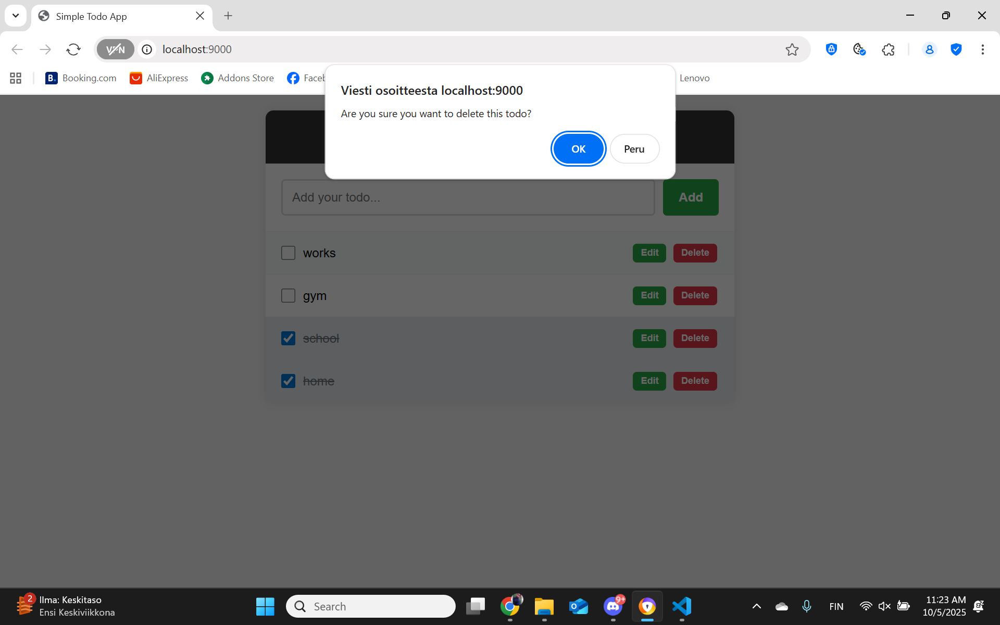
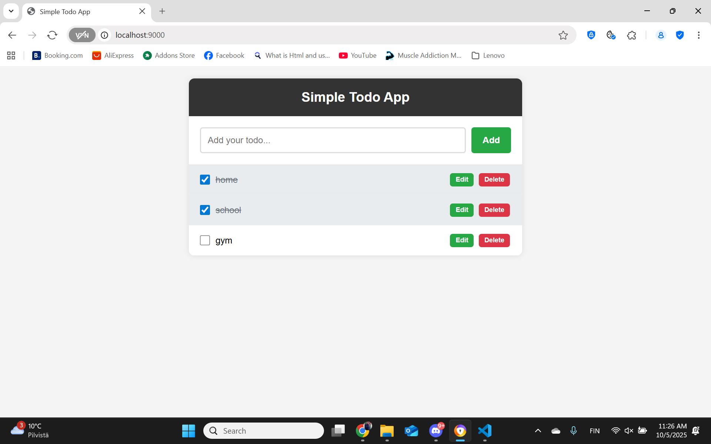
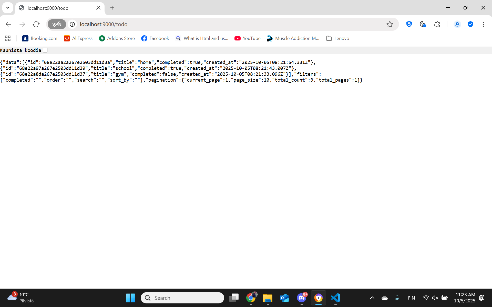
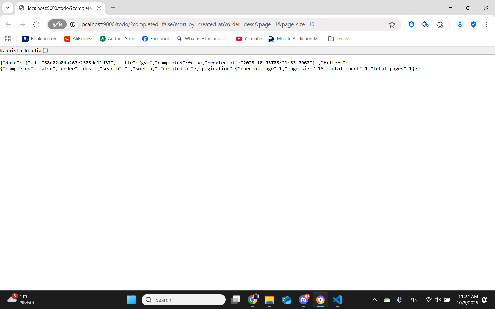
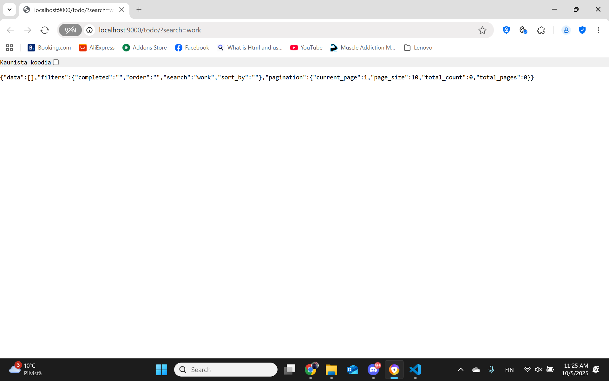

# Todo Application


A simple and efficient Todo application built with Go and MongoDB, featuring a RESTful API with **advanced filtering, sorting, and pagination** capabilities.

## Features

- ✅ Create, read, update, and delete todos (CRUD)
- ⚡ **Instant Add** - New todos appear immediately without page refresh
- 🔍 **Advanced Filtering** - Filter by completion status and search text
- 📊 **Sorting** - Sort by title, created_at, or completed status (asc/desc)
- 📄 **Pagination** - Page through results with metadata
- 🗄️ MongoDB integration for persistent storage
- 🌐 RESTful API endpoints
- 📱 Responsive web interface with HTML templates
- ⚡ Fast and lightweight Go backend with utils package
- 🔧 Graceful server shutdown
- 🎯 Comprehensive input validation
- 🛠️ **Utils Package** - Centralized helper functions for cleaner code

## Screenshots

### Web Interface

*Main todo application interface showing add/edit/delete functionality*


*Checking off completed todos*


*Editing todo items*


*Updated todo showing changes*


*Delete confirmation dialog*


*Final state after operations*

### API Responses


*Basic API response showing all todos with pagination metadata*

#### Advanced Filtering & Sorting

*API response with filtering: `?completed=false&sort_by=created_at&order=desc`*

#### Pagination

*API response with pagination: `?page=1&page_size=5`*


*Detailed pagination metadata showing current_page, page_size, total_count, and total_pages*

#### Search Functionality

*Search functionality: `?search=work` showing filtered results*

## Prerequisites

Before running this application, make sure you have:

- **Go 1.16+** installed
- **MongoDB** running on port 27017 (default)

## Installation

1. Clone or download the project:
   ```bash
   git clone <repository-url>
   cd go
   ```

2. Install dependencies:
   ```bash
   go mod download
   ```

## Running the Application

### Method 1: Run directly from source
```bash
go run main.go
```

### Method 2: Build and run executable
```bash
# Build the application
go build -o todo.exe main.go

# Run the executable
./todo.exe
```

The application will start on port **9000** by default.

## Configuration

### MongoDB Connection
By default, the application connects to MongoDB at `mongodb://localhost:27017`. You can override this by setting the `MONGO_URL` environment variable:

```bash
# Windows (PowerShell)
$env:MONGO_URL="mongodb://your-mongodb-url"

# Windows (Command Prompt)
set MONGO_URL=mongodb://your-mongodb-url

# Linux/MacOS
export MONGO_URL="mongodb://your-mongodb-url"
```

## API Endpoints

The application provides the following RESTful API endpoints:

| Method | Endpoint | Description |
|--------|----------|-------------|
| GET | `/` | Home page |
| GET | `/todo/` | Get all todos |
| POST | `/todo/` | Create a new todo |
| PUT | `/todo/{id}` | Update an existing todo |
| DELETE | `/todo/{id}` | Delete a todo |

### API Examples

#### Create a Todo
```bash
curl -X POST http://localhost:9000/todo/ \
  -H "Content-Type: application/json" \
  -d '{"title": "Learn Go programming"}'
```

**Response:**
```json
{
  "message": "Todo created successfully",
  "todo_id": "68e25482c0e97adfdb5dbc98",
  "todo": {
    "id": "68e25482c0e97adfdb5dbc98",
    "title": "Learn Go programming", 
    "completed": false,
    "created_at": "2025-10-05T14:23:04Z"
  }
}
```

#### Get All Todos
```bash
curl http://localhost:9000/todo/
```

#### Advanced Query Examples
```bash
# Filter by completion status
curl "http://localhost:9000/todo/?completed=true"

# Search in titles
curl "http://localhost:9000/todo/?search=work"

# Sort by title (ascending)
curl "http://localhost:9000/todo/?sort_by=title&order=asc"

# Pagination
curl "http://localhost:9000/todo/?page=1&page_size=5"

# Combined filters
curl "http://localhost:9000/todo/?completed=false&sort_by=created_at&order=desc&page=1&page_size=10"
```

#### Update a Todo
```bash
curl -X PUT http://localhost:9000/todo/{id} \
  -H "Content-Type: application/json" \
  -d '{"title": "Learn Go programming", "completed": true}'
```

#### Delete a Todo
```bash
curl -X DELETE http://localhost:9000/todo/{id}
```

## Project Structure

```
├── main.go          # Main application file
├── go.mod           # Go module dependencies  
├── go.sum           # Dependency checksums
├── README.md        # Project documentation
├── todo.exe         # Compiled executable
├── handlers/
│   └── todo.go      # HTTP request handlers (refactored with utils)
├── image/           # Screenshots for documentation
│   ├── todo1.png    # Interface screenshots
│   ├── todo2.png    # Various app states
│   └── ...          # More screenshots
├── models/
│   └── todo.go      # Data structures and models
├── routes/
│   └── todo.go      # URL routing configuration
├── static/
│   └── home.tpl     # HTML template with instant add feature
└── utils/           # 🆕 Utility functions (NEW!)
    ├── response.go  # HTTP response helpers
    ├── string.go    # String manipulation utilities
    ├── mongodb.go   # MongoDB helper functions
    └── pagination.go # Pagination logic
```

## Data Model

### Todo Structure
```json
{
  "id": "string",
  "title": "string",
  "completed": boolean,
  "created_at": "datetime"
}
```

## 🆕 NEW: Utils Package

This project now includes a comprehensive **utils package** that makes the code more maintainable and reusable:

### 📁 Utils Functions

#### `response.go` - HTTP Response Helpers
- `RespondWithError()` - Standardized error responses
- `RespondWithSuccess()` - Standardized success responses  
- `RespondWithJSON()` - Generic JSON responses

#### `string.go` - String Utilities
- `StringToInt()` - Safe string to integer conversion with defaults
- `StringToBool()` - String to boolean conversion
- `IsValidString()` - String validation (non-empty after trim)
- `TrimAndLower()` - String normalization

#### `mongodb.go` - MongoDB Helpers
- `ObjectIDFromString()` - Safe ObjectID conversion
- `IsValidObjectID()` - ObjectID validation
- `CurrentTime()` - Standardized time handling
- `FormatTime()` - Time formatting

#### `pagination.go` - Pagination Logic
- `NewPaginationParams()` - Create validated pagination parameters
- `NewPaginationResponse()` - Generate pagination metadata
- Auto-validates page/page_size limits

### 🎯 Benefits
- **90% less repetitive code** - Centralized common functionality
- **Better error handling** - Consistent response formats
- **Safer operations** - Built-in validation and defaults
- **Easier maintenance** - Change logic in one place

## Dependencies

- **Chi Router** (`github.com/go-chi/chi`) - HTTP router and URL matcher
- **Renderer** (`github.com/thedevsaddam/renderer`) - Template rendering
- **MongoDB Driver** (`go.mongodb.org/mongo-driver`) - MongoDB client

## Database

The application uses MongoDB with the following configuration:
- **Database Name**: `demo_todo`
- **Collection Name**: `todo`
- **Default Port**: `27017`

## Development

### Building for Production
```bash
# Build for current platform
go build -o todo main.go

# Build for Windows
GOOS=windows GOARCH=amd64 go build -o todo.exe main.go

# Build for Linux
GOOS=linux GOARCH=amd64 go build -o todo main.go
```

### Running Tests
```bash
go test ./...
```

## Live Demo Features

The screenshots above demonstrate all the advanced features in action:

### ✅ **Step 2: Basic CRUD Operations**
- **Create**: Add new todos through web interface
- **Read**: View all todos in both web UI and JSON API  
- **Update**: Edit todo titles and mark as completed
- **Delete**: Remove todos with confirmation dialog

### 🚀 **Step 3: Advanced Features (3+ implemented)**

#### 🔍 **1. Filtering**
- `?completed=true/false` - Filter by completion status
- `?search=text` - Search in todo titles (case-insensitive)
- **Example**: `?search=work` returns only todos containing "work"

#### 📊 **2. Sorting** 
- `?sort_by=title|created_at|completed` - Sort by different fields
- `?order=asc|desc` - Ascending or descending order
- **Example**: `?sort_by=created_at&order=desc` - Newest first

#### 📄 **3. Pagination**
- `?page=1&page_size=5` - Control page number and items per page
- Returns metadata: `current_page`, `total_count`, `total_pages`
- **Example**: `?page=1&page_size=5` shows first 5 todos with navigation info

### 🎯 **Combined Example**
```
GET /todo?completed=false&sort_by=created_at&order=desc&page=1&page_size=10
```
*Returns first 10 incomplete todos, sorted by creation date (newest first)*

## 🆕 Latest Improvements

### ⚡ Instant Add Feature
- **No more page refreshes!** - New todos appear immediately in the list
- Auto-clears input field after adding
- Real-time UI updates using JavaScript fetch API
- Enhanced error handling with user-friendly messages

### 🛠️ Code Refactoring with Utils Package
- **Cleaner codebase** - Moved common functions to utils package
- **Better error handling** - Centralized response formatting
- **Safer validation** - Built-in input validation and sanitization
- **Improved pagination** - Automated pagination logic with proper defaults

## Contributing

1. Fork the repository
2. Create your feature branch (`git checkout -b feature/amazing-feature`)
3. Commit your changes (`git commit -m 'Add some amazing feature'`)
4. Push to the branch (`git push origin feature/amazing-feature`)
5. Open a Pull Request

## License

This project is licensed under the MIT License - see the LICENSE file for details.

## Troubleshooting

### Common Issues

1. **Port 9000 already in use**
   - Stop any running instances: `taskkill /f /im todo.exe`
   - Or change the port in `main.go`

2. **Cannot connect to MongoDB**
   - Ensure MongoDB is running: `net start MongoDB`
   - Check MongoDB is listening on port 27017: `netstat -an | findstr 27017`

3. **Module not found errors**
   - Run: `go mod download`
   - Ensure Go modules are enabled: `go env GO111MODULE`

## Author

Built with ❤️ using Go and MongoDB